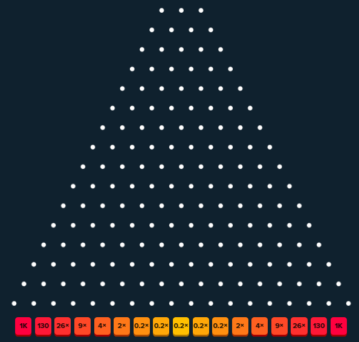

# laughing-broccoli

Stake.us Plinko analysis/learning.

## Introduction

Recently, I sustained some long-term injury - something like a back sprain, or pinched nerve - which refuses to go away, and has stopped me from pursuing my main hobby, climbing. In order to fill the void, I have decided to pick up a new hobby: online gambling. In particular, I have decided that I like the predictability of [Plinko](https://stake.us/casino/games/plinko).

Plinko contains the following parameters:
* The number of Gold coins, a virtual currency used by Stake.us, to bet (continuous, real);
* the Risk (discrete, enumerable) - selecting from Low, Medium, and High;
* the Rows (discrete, integral) - ranging from 8 to 16;
* and the Numbers of Games (continuous, integral) - which must be at least 1.

Based on your configuration of Risk and Rows, there are destinations for your game's ball, with the center having the highest probability and lowest reawrd, like this:

Given a fixed Number of Rows, a higher Risk will make the middle columns have lower rewards, and the outer columns will have higher rewards. Moreover, the lowest reward will be the same at each Risk no matter what the Number of Rows is parameterized to, hence the "lower risk" at Low Risk (you can only ever lose half, and no more).

This project contains data sheets describing the mathematical makeup of Plinko (last updated 1/16/2025) and some Python scripts generating summary statistics. Later, I plan to implement a C++ library that is used for simulation, as well as some driver code for ML and analysis.
